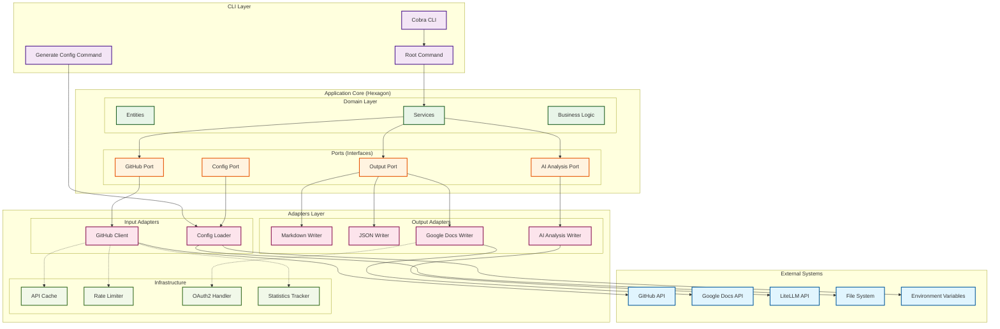

# GitHub OKR Fetcher - Architecture

## Overview

The GitHub OKR Fetcher follows **Hexagonal Architecture** (also known as Ports and Adapters pattern) to achieve clean separation of concerns, testability, and maintainability.

## Architecture Diagram

## Architecture Layers

### 1. CLI Layer
- **Cobra CLI**: Professional command-line interface
- **Root Command**: Main application entry point and orchestration
- **Generate Config**: Configuration file generation subcommand

### 2. Application Core (Hexagon)

#### Domain Layer
- **Entities**: Core business objects (Config, Issue, ProjectInfo, WeeklyUpdate)
- **Services**: Business logic orchestration
- **Status Detection**: Intelligent OKR status determination logic

#### Ports (Interfaces)
- **GitHub Port**: Interface for GitHub API operations
- **Output Port**: Interface for report generation
- **Config Port**: Interface for configuration management
- **AI Analysis Port**: Interface for LiteLLM integration

### 3. Adapters Layer

#### Input Adapters
- **GitHub Client**: GitHub API integration with rate limiting and caching
- **Config Loader**: JSON configuration and environment variable handling

#### Output Adapters
- **Markdown Writer**: Rich markdown report generation
- **JSON Writer**: Structured data export
- **Google Docs Writer**: Native Google Docs API integration with OAuth2
- **AI Analysis Writer**: LiteLLM integration for business insights

#### Infrastructure
- **API Cache**: In-memory response caching with TTL
- **Rate Limiter**: GitHub API rate limiting with retry mechanisms
- **OAuth2 Handler**: Google authentication with browser automation
- **Statistics Tracker**: API usage and performance metrics

## Key Design Principles

### 1. Dependency Inversion
- Core business logic depends only on interfaces (ports)
- External dependencies are injected through adapters
- Easy to test and mock external systems

### 2. Single Responsibility
- Each adapter has a single, well-defined responsibility
- Clear separation between data fetching, processing, and output
- Modular components that can be independently tested

### 3. Open/Closed Principle
- Easy to add new output formats by implementing the Output Port
- New data sources can be added through new adapters
- Core business logic remains unchanged when adding features

### 4. Configuration-Driven
- Behavior controlled through JSON configuration
- Environment variables for sensitive data
- Runtime configuration without code changes

## Data Flow

1. **CLI** receives user commands and flags
2. **Root Command** loads configuration and initializes services
3. **Domain Services** orchestrate business logic using ports
4. **GitHub Adapter** fetches issues and comments with caching/rate limiting
5. **AI Adapter** (optional) analyzes data for business insights
6. **Output Adapters** generate reports in requested formats
7. **Infrastructure** provides cross-cutting concerns (caching, auth, metrics)

## Benefits of This Architecture

### Testability
- Domain logic can be unit tested in isolation
- Adapters can be mocked for integration testing
- Clear boundaries make testing straightforward

### Maintainability
- Changes to external APIs only affect adapters
- Business logic is protected from infrastructure changes
- Code is organized by responsibility

### Extensibility
- New output formats: implement Output Port
- New data sources: implement GitHub Port
- New AI providers: implement AI Analysis Port

### Security
- Sensitive data (tokens) handled only in adapters
- Environment variable injection at the edges
- OAuth2 flows isolated in dedicated adapters

## Technology Stack

- **Language**: Go 1.23+
- **CLI Framework**: Cobra
- **HTTP Client**: Go standard library + go-github
- **OAuth2**: golang.org/x/oauth2
- **Rate Limiting**: golang.org/x/time/rate
- **JSON Processing**: Go standard library
- **External APIs**: GitHub v4, Google Docs v1, LiteLLM

This architecture ensures the GitHub OKR Fetcher is maintainable, testable, and extensible while following Go best practices and clean architecture principles.